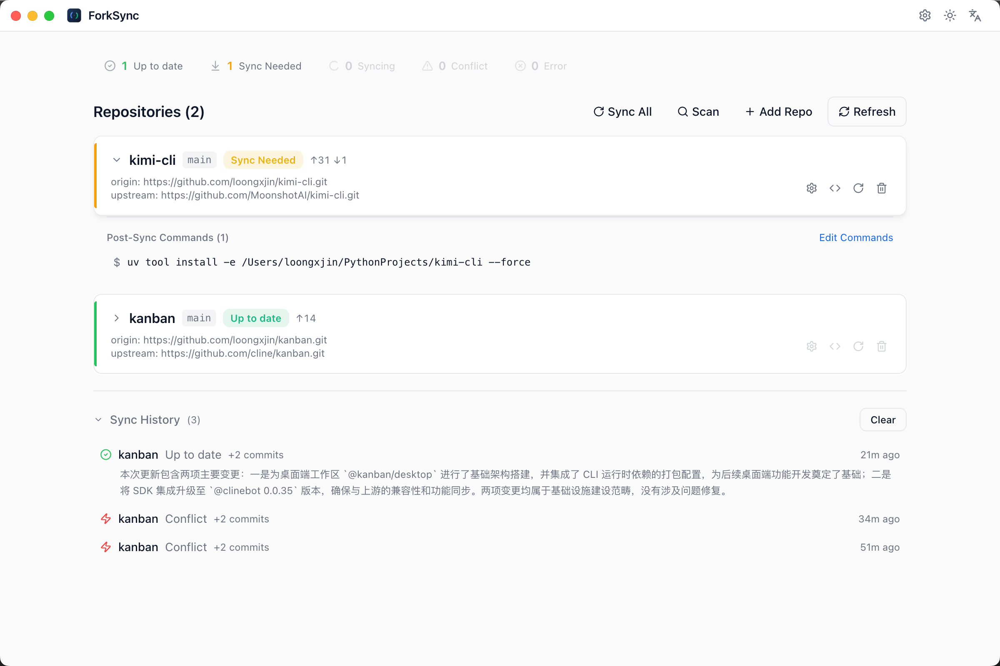

<div align="center">

# ForkSync

**Auto-sync your GitHub fork repos — resolve conflicts with AI.**

[English](./README.md) · [中文](./README_zh.md)

[](https://go.dev/)
[](https://wails.io/)
[](https://react.dev/)
[](./LICENSE)

</div>

<p align="center">
  
</p>

---

## Why ForkSync?

Maintaining forked repositories is tedious. Upstream authors keep shipping changes, and every sync risks merge conflicts. You either:

- **Forget to sync** — your fork falls behind, missing bug fixes and features
- **Resolve conflicts manually** — reading `<<<<<<<` markers for hours
- **Give up and re-fork** — losing your local modifications

**ForkSync solves this.** It automatically syncs your forks and uses AI coding agents (Claude Code, OpenCode, Codex) to resolve merge conflicts — so you never have to touch conflict markers again.

## Key Features

| Feature | Description |
|---------|-------------|
| **Auto Sync** | Periodically fetches and merges upstream changes (configurable interval) |
| **AI Conflict Resolution** | Delegates merge conflicts to AI agents with git-aware prompts |
| **Workflow-guided UI** | Step-by-step workflow: fetch → merge → detect conflicts → agent resolve → review → commit |
| **Live Agent Terminal** | Real-time streaming view of agent output (stdout, tool calls, errors) during resolution |
| **Desktop App** | Polished Wails GUI — dashboard, workflow steps, settings |
| **HTTP API** | REST + WebSocket server for programmatic access |
| **Directory Scanner** | Recursively scans any directory to discover and batch-add fork repos |
| **Sync History** | SQLite-backed history with filters, AI-generated summaries, and cleanup |
| **System Notifications** | Desktop native alerts on sync success, conflicts, or errors |
| **IDE Integration** | Open repos directly in VSCode, Cursor, or Trae |
| **Post-sync Commands** | Execute custom scripts after a successful sync (e.g. `pip install`, `npm build`) |
| **i18n** | Multi-language interface (Chinese / English) |
| **Multiple Agents** | Switch between Claude Code and OpenCode freely |

---

## Install

### Download

Grab the latest release for your platform:

| Platform | Format | Link |
|----------|--------|------|
| macOS | `.dmg` | [Releases](https://github.com/loongxjin/forksync/releases) |
| Linux | `.AppImage` | [Releases](https://github.com/loongxjin/forksync/releases) |
| Windows | `.exe` (NSIS) | [Releases](https://github.com/loongxjin/forksync/releases) |

### Build from Source

```bash
git clone https://github.com/loongxjin/forksync.git
cd forksync

# Wails build (single binary, ~18MB)
make wails
# Output: build/bin/
```

### Standalone HTTP Server

The engine can also run as a headless HTTP server for programmatic access:

```bash
cd engine && go build -o forksync .
./forksync -addr 127.0.0.1:8080
# Prints FORKSYNC_HTTP_ADDR=127.0.0.1:8080 at startup
# Then all engine ops are available via REST — see engine/README.md
```

---

## Quick Start

### 1. Configure GitHub Token (Recommended)

```bash
mkdir -p ~/.forksync
```

Edit `~/.forksync/config.yaml`:

```yaml
github:
  token: "ghp_your_token_here"
```

> Token is optional but recommended — it enables automatic upstream detection via GitHub API.

### 2. Launch the App

```bash
# Dev mode (hot reload)
make wails-dev

# Or build and run
make wails && open build/bin/forksync.app
```

The Wails app embeds the Go engine directly — no separate server process, no HTTP bridge. All engine operations are native Go function calls.

---

## AI Conflict Resolution

This is the core feature that sets ForkSync apart. When a sync produces merge conflicts, ForkSync can automatically delegate resolution to an AI coding agent:

```
┌─────────────┐    conflict     ┌───────────────┐    resolve    ┌────────────────┐
│   Upstream   │ ──────────────▶ │  ForkSync     │ ────────────▶│  AI Agent      │
│   Change     │                 │  detects      │              │  (Claude /     │
└─────────────┘                 │  conflict     │              │   OpenCode)    │
                                └───────────────┘              └───────┬────────┘
                                                                       │ resolved
                                                                       ▼
                                ┌───────────────┐              ┌────────────────┐
                                │  ForkSync     │ ◀───────────│  Verify &      │
                                │  commits      │   commit    │  Stage         │
                                └───────────────┘              └────────────────┘
```

**Supported Agents:**

| Agent | Binary | Auto-detected |
|-------|--------|:------------:|
| Claude Code | `claude` | ✅ |
| OpenCode | `opencode` | ✅ |
| Codex | `codex` | ✅ |

Agents are auto-discovered via `PATH`. Set a preferred agent in config:

```yaml
agent:
  preferred: "claude"
```

**Conflict resolution strategies:**

| Strategy | Config key | Behavior |
|----------|-----------|----------|
| Auto-resolve with agent | `conflict_strategy: agent_resolve` | Agent resolves conflicts automatically |
| Manual resolve | `conflict_strategy: manual` | Pause at workflow — user chooses to resolve with agent or manually |
| Preserve local | `resolve_strategy: preserve_ours` | Agent told to keep local changes, accept upstream non-conflicting |
| Preserve upstream | `resolve_strategy: preserve_theirs` | Agent told to prefer upstream changes |
| Balanced | `resolve_strategy: balanced` | Agent told to smart-merge preserving both sides |

**Confirmation modes:**

| Config | Behavior |
|--------|----------|
| `confirm_before_commit: true` | After agent resolves, wait for user review and accept/reject |
| `confirm_before_commit: false` | Auto-commit immediately after agent resolves |

	**Post-sync Commands:** Configured per-repo in the settings dialog of the desktop app (add/edit/delete shell commands to run after each successful sync).

---

## Desktop App

Built with **Wails v2** + **React** + **TypeScript** + **Tailwind CSS** + **shadcn/ui**.

| Section | Description |
|------|-------------|
| **Dashboard** | Overview: repo statuses, recent sync activity |
| **Repo List** | Expandable repo cards with workflow steps or detail panel |
| **Workflow Steps** | Step-by-step progress: fetch → merge → check conflicts → resolve strategy → agent resolve → accept → commit |
| **Agent Terminal** | Real-time streaming view of agent output during resolution |
| **AI Summary** | After resolution, agent's git-history-aware summary in workflow |
| **Diff Viewer** | Side-by-side diff preview when reviewing changes |
| **History** | Sync timeline with filters, AI-generated summaries, and cleanup |
| **Settings** | General, agent config, post-sync commands, IDE preferences |

**Architecture:**

```
┌────────────────────────────────────────────┐
│            Wails UI (React)                 │
│  Dashboard · Repos · Workflow               │
│  Agent Terminal · History · Settings        │
└────────────────┬───────────────────────────┘
                 │ Wails binding (direct Go call)
┌────────────────▼───────────────────────────┐
│      Go Engine (same process, no IPC)        │
│  App struct with 34 bound methods            │
│  Internal: sync · resolve · agent            │
│            history · scheduler · eventbus    │
│            ide · config · summarize          │
└────────────────────────────────────────────┘
```

In the Wails desktop app, the engine runs **in-process** — all 34 methods are Go struct methods bound to the frontend via Wails auto-generated TypeScript bindings, with no HTTP/IPC between them. Streaming uses Wails Events instead of WebSocket.

The same engine can also run as a **standalone HTTP server** for headless or programmatic access (`cd engine && go build`). See [Standalone HTTP Server](#standalone-http-server) above.

---

## Engine API

All engine operations are available as **Wails bindings** (direct Go calls from the React frontend). A standalone HTTP server is also available for headless use. See `engine/README.md` for the HTTP API reference.

| Operation | HTTP Route |
|---|---|
| Status | `GET /status` |
| Scan | `POST /scan` |
| Add repo | `POST /repos` |
| Remove repo | `DELETE /repos/{name}` |
| Sync all | `POST /sync/all` |
| Sync one | `POST /sync/repos/{name}` |
| Resolve | `POST /repos/{name}/resolve` |
| Resolve stream | `WS /stream/resolve/{name}` |
| Agents | `GET /agents` |
| History | `GET /history?repo=&limit=` |
| Config | `GET /config` / `PUT /config` |
| Post-sync | `GET/POST/DELETE /repos/{name}/post-sync` |
| Summarize | `POST /repos/{name}/summarize` |


