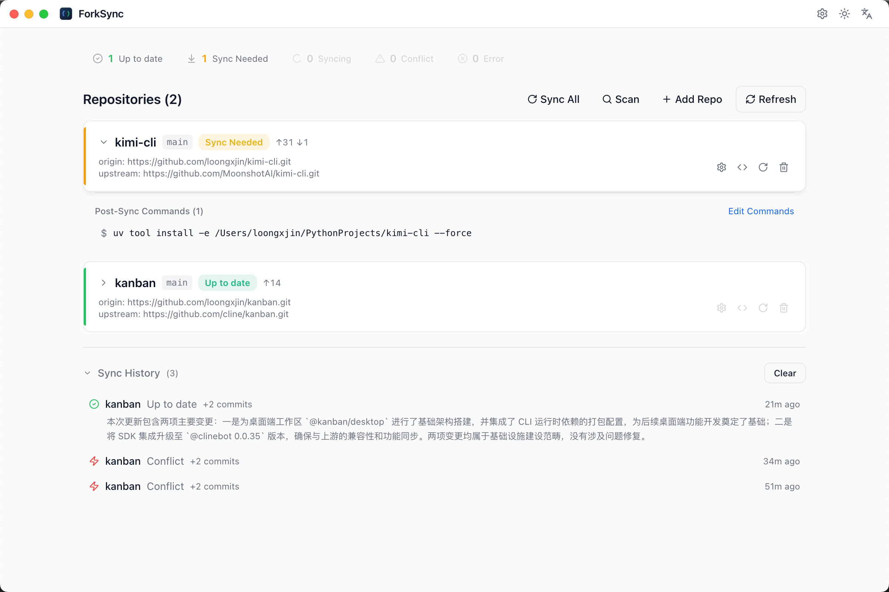

<div align="center">

# 🔀 ForkSync

**自动同步 GitHub Fork 仓库 — AI 解决合并冲突。**

[English](./README.md) · **中文**

[](https://go.dev/)
[](https://www.electronjs.org/)
[](https://react.dev/)
[](./LICENSE)

</div>

<p align="center">
  
</p>

---

## 为什么需要 ForkSync？

维护 Fork 仓库是一件苦差事。上游作者不断发布更新，每次同步都可能遇到合并冲突。你通常面临：

- ❌ **忘记同步** — Fork 落后于上游，错过 Bug 修复和新功能
- ❌ **手动解决冲突** — 在 `<<<<<<<` 标记中翻来覆去读几个小时
- ❌ **放弃重新 Fork** — 丢失你自己的本地修改

**ForkSync 解决了这个问题。** 它自动同步你的 Fork 仓库，并在出现合并冲突时调用 AI 编码助手（Claude Code、OpenCode、Droid、Codex）自动解决 — 你再也不用手动处理冲突标记。

## ✨ 核心功能

| 功能 | 说明 |
|------|------|
| 🔄 **自动同步** | 定时拉取并合并上游变更（可自定义间隔） |
| 🤖 **AI 冲突解决** | 将合并冲突委托给 AI Agent（Claude Code、OpenCode、Droid、Codex）自动处理 |
| 🖥️ **桌面应用** | 精致的 Electron GUI — 仪表盘、冲突查看器、设置页 |
| ⌨️ **命令行工具** | 功能完整的 CLI，适合终端工作流 |
| 🔍 **目录扫描** | 递归扫描任意目录，自动发现并批量添加 Fork 仓库 |
| 📝 **同步历史** | 基于 SQLite 的历史记录，支持筛选、AI 摘要和清理 |
| 🔔 **系统通知** | macOS 原生通知，同步成功/冲突/错误即时提醒 |
| 🖥️ **IDE 集成** | 一键在 VSCode、Cursor 或 Trae 中打开仓库 |
| 🌐 **国际化** | 多语言界面支持 |
| ⚙️ **灵活策略** | `preserve_ours` / `preserve_theirs` / `balanced` / `agent_resolve` |

---

## 📦 安装

### 下载安装

根据你的平台下载最新版本：

| 平台 | 格式 | 链接 |
|------|------|------|
| macOS | `.dmg` | [Releases](https://github.com/loongxjin/forksync/releases) |
| Linux | `.AppImage` | [Releases](https://github.com/loongxjin/forksync/releases) |
| Windows | `.exe` (NSIS) | [Releases](https://github.com/loongxjin/forksync/releases) |

### 从源码构建

```bash
git clone https://github.com/loongxjin/forksync.git
cd forksync

# 完整构建（Go 引擎 + Electron 应用）
make build
# 产物：app/dist/
```

### 仅命令行

```bash
cd engine && go build -o forksync . && ./forksync --help
```

---

## 🚀 快速开始

### 1. 配置 GitHub Token（推荐）

```bash
mkdir -p ~/.forksync
```

编辑 `~/.forksync/config.yaml`：

```yaml
github:
  token: "ghp_你的token"
```

> Token 为可选项，但强烈建议配置 — 它可以启用通过 GitHub API 自动检测上游仓库。

### 2. 添加仓库

```bash
# 添加单个仓库
forksync add ~/projects/my-fork

# 扫描目录，批量发现 Fork 仓库
forksync scan ~/projects
```

### 3. 同步

```bash
# 同步所有仓库
forksync sync --all

# 同步指定仓库
forksync sync my-fork

# 启动后台同步服务（默认每 30 分钟）
forksync serve
```

### 4. AI 解决冲突

```bash
# 使用 AI 解决冲突（交互式）
forksync resolve my-fork

# 指定 Agent，自动提交
forksync resolve my-fork --agent claude --no-confirm
```

### 5. 启动桌面应用

```bash
cd app && npm install && npm run dev
```

---

## 🤖 AI 冲突解决

这是 ForkSync 最核心的功能。当同步产生合并冲突时，ForkSync 可以自动委托 AI 编码助手处理：

```
┌─────────────┐    冲突发生     ┌───────────────┐    调用       ┌────────────────┐
│   上游变更    │ ──────────────▶ │  ForkSync     │ ────────────▶│  AI Agent      │
│              │                 │  检测到冲突    │              │  (Claude等)    │
└─────────────┘                 └───────────────┘              └───────┬────────┘
                                                                      │
                                                                      │ 解决完成
                                                                      ▼
                                ┌───────────────┐              ┌────────────────┐
                                │  ForkSync     │ ◀───────────│  验证并提交     │
                                │  提交变更      │   确认提交   │                │
                                └───────────────┘              └────────────────┘
```

**支持的 Agent：**

| Agent | 可执行文件 | 自动检测 |
|-------|-----------|:-------:|
| Claude Code | `claude` | ✅ |
| OpenCode | `opencode` | ✅ |
| Droid | `droid` | ✅ |
| Codex | `codex` | ✅ |

Agent 通过系统 `PATH` 自动发现。在配置文件中设置首选 Agent：

```yaml
agent:
  preferred: "claude"
  conflict_strategy: "agent_resolve"
```

**冲突解决策略：**

| 策略 | 行为 |
|------|------|
| `preserve_ours` | 保留本地修改，接受非冲突的上游变更 |
| `preserve_theirs` | 优先采用上游变更 |
| `balanced` | 智能合并，尽量保留双方变更 |
| `agent_resolve` | 委托 AI Agent 自动解决 |

---

## 🖥️ 桌面应用

基于 **Electron** + **React** + **TypeScript** + **Tailwind CSS** + **shadcn/ui** 构建。

| 页面 | 说明 |
|------|------|
| **仪表盘** | 总览：已同步/冲突/同步中数量，最近活动，Agent 状态 |
| **仓库管理** | 添加、扫描目录、同步、移除仓库 |
| **冲突列表** | 列出有冲突的仓库，通过 Agent 解决 |
| **冲突详情** | Diff 查看器、Agent 总结、接受/拒绝解决结果 |
| **同步历史** | 同步历史时间线，支持筛选和清理 |
| **设置** | 通用设置、Agent 配置、IDE 偏好、主题切换 |

**架构：**

```
┌───────────────────────────────────┐
│       Electron UI (React)          │
│  仪表盘 · 仓库管理 · 冲突列表      │
│  同步历史 · 设置 · 冲突详情        │
└───────────────┬───────────────────┘
                │ IPC (contextBridge)
┌───────────────▼───────────────────┐
│     EngineClient (TypeScript)      │
│  启动 Go 二进制文件，解析 JSON 输出  │
└───────────────┬───────────────────┘
                │ --json 参数
┌───────────────▼───────────────────┐
│        Go CLI 引擎 (Cobra)         │
│  add · sync · resolve · serve      │
│  agent · config · history          │
└───────────────────────────────────┘
```

---

## ⌨️ 命令行参考

所有命令支持 `--json` 参数输出结构化 JSON。

```bash
# 仓库管理
forksync add <路径> [--upstream <url>]         # 添加仓库
forksync remove <名称>                         # 从管理列表移除
forksync scan <目录>                           # 批量发现 Fork 仓库

# 同步
forksync sync [--all | <名称>]                # 同步仓库
forksync serve [--interval 15m]               # 后台同步服务
forksync status                               # 查看所有仓库状态

# AI 冲突解决
forksync resolve <名称> [--agent claude] [--no-confirm] [--accept] [--reject]

# Agent 管理
forksync agent list                           # 检测已安装的 Agent
forksync agent sessions                       # 列出活跃会话
forksync agent cleanup                        # 清理过期会话

# 配置
forksync config get                           # 显示所有配置
forksync config set <key> <value>             # 设置配置值
forksync config keys                          # 列出可用配置键

# 历史
forksync history [--limit 20] [--cleanup [--keep-days 30]]
```

---

## ⚙️ 配置

**配置文件路径：** `~/.forksync/config.yaml`

```yaml
sync:
  default_interval: "30m"
  sync_on_startup: true

agent:
  preferred: "claude"
  priority: [claude, opencode, droid, codex]
  timeout: "10m"
  conflict_strategy: "agent_resolve"
  confirm_before_commit: true
  session_ttl: "24h"

github:
  token: ""

notification:
  enabled: true

proxy:
  enabled: false
  url: ""
```

**数据文件：**

| 路径 | 用途 |
|------|------|
| `~/.forksync/config.yaml` | 用户配置 |
| `~/.forksync/repos.json` | 受管仓库列表 |
| `~/.forksync/sessions/<id>.json` | Agent 会话记录 |
| `~/.forksync/db/forksync.db` | SQLite 同步历史数据库 |
| `~/.forksync/logs/sync-*.log` | 按日轮转的日志文件 |

---

## 🏗️ 项目结构

```
forksync/
├── engine/                      # Go CLI 引擎
│   ├── cmd/                     # Cobra 命令
│   ├── internal/
│   │   ├── agent/               # AI Agent 适配器（Claude、OpenCode、Droid、Codex）
│   │   │   └── session/         # 会话生命周期管理
│   │   ├── config/              # 基于 Viper 的 YAML 配置
│   │   ├── conflict/            # 合并冲突检测
│   │   ├── git/                 # Git 操作（go-git 库 + CLI 回退）
│   │   ├── github/              # GitHub REST API 客户端
│   │   ├── history/             # SQLite 同步历史存储
│   │   ├── logger/              # 文件日志，按日轮转
│   │   ├── notify/              # macOS 系统通知
│   │   ├── repo/                # 仓库 JSON 存储（线程安全）
│   │   ├── scheduler/           # 后台同步调度器
│   │   └── sync/                # 核心同步管线
│   └── pkg/types/               # 共享类型
│
├── app/                         # Electron 桌面应用
│   ├── src/main/                # Electron 主进程 + EngineClient
│   ├── src/preload/             # 上下文桥接（window.api）
│   └── src/renderer/            # React UI（页面、组件、Context）
│
├── build/                       # 构建脚本
└── docs/                        # 文档
```

---

## 🧪 测试

```bash
cd engine && go test ./... -v
```

**146 个测试**，分布在 15 个测试文件中 — 覆盖同步管线、Agent 适配器、会话管理、Git 操作、冲突检测、配置、历史记录等模块。

---

## 🛠️ 开发

请阅读 [开发指南](./docs/DEVELOPMENT.md) 了解环境搭建和架构细节。

## 📝 许可证

[MIT](./LICENSE)
